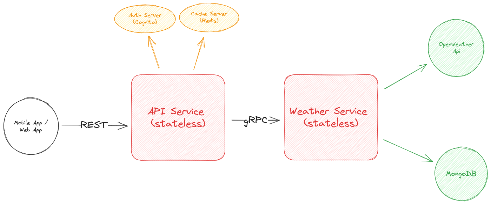

## Design and Architecture

## Project Structure

- **api-gateway**: NestJS application that acts as a gateway for REST API requests.

  - **src**: Source code for the NestJS application.
    - **test**: Integration and e2e tests for the NestJS application.
    - **app**: Nestjs root app controller, service and module.
    - **city**: Nestjs city module.
    - **config**: All configurations.
    - **types**: General Types.
    - **utils**: service utils such as loggerSetup, gRPC client setup, etc.

- **docs**: Project documentations.
- **weather-service**: Node.js application that acts as the gRPC server providing weather data.

  - **src**: Source codes.
    - **city**: city gRPC messages.
    - **config**: All configurations.
    - **types**: General Types.
    - **utils**: service utils such as openWeather (OpenWeatherApi handler).

- **proto**: gRPC proto files.
